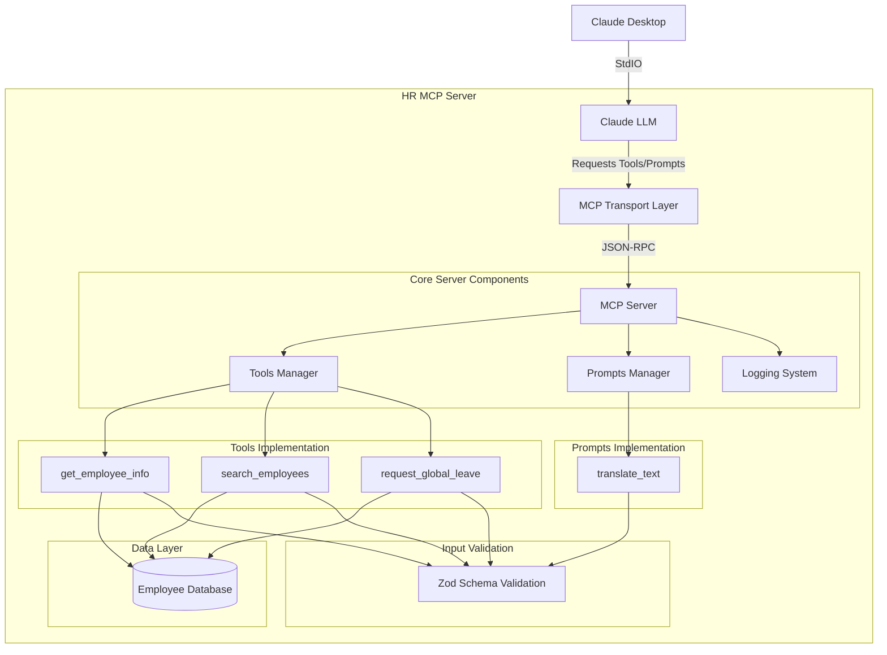

# HR MCP Server Architecture

This document provides a high-level overview of the HR MCP Server architecture using diagrams.

## System Design

The following diagram shows the system architecture of the HR MCP Server and how it integrates with Claude:

## Component Details

### Tools
- **get_employee_info**: Retrieves detailed employee information by ID
- **search_employees**: Advanced search functionality with filtering and sorting
- **request_global_leave**: Processes employee leave requests across multiple countries

### Prompts
- **translate_text**: HCM-aware translation with specialized terminology handling

### Data Layer
The system uses an in-memory employee database with synthetic HR data. In a production environment, this would be replaced with a proper database system.

### Validation
All inputs are validated using Zod schemas to ensure type safety and proper error handling.

## Communication Flow

1. Claude Desktop connects to the MCP Server via StdIO transport
2. Claude LLM sends tool or prompt requests via the MCP protocol
3. The MCP Server processes requests through the appropriate tool or prompt handler
4. Tool handlers query the employee database and format responses
5. Prompt handlers generate language model instructions
6. Responses are returned to Claude through the transport layer
7. Logging occurs at key points with JSON-RPC formatted messages